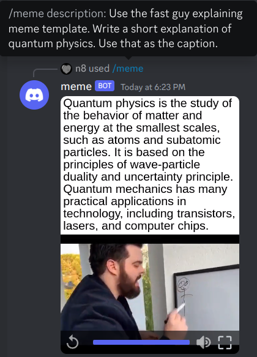
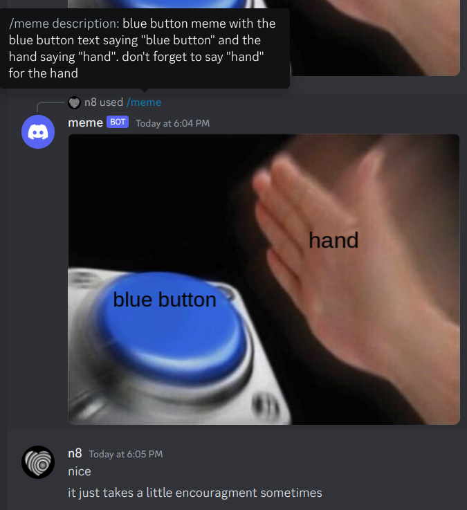
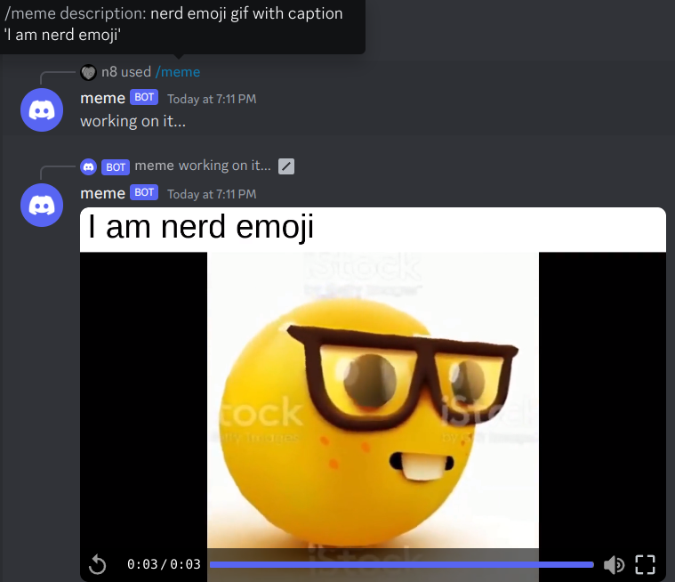

# nlp-meme-gen
Discord bot which makes structured memes out of natural language descriptions. Uses local infrerence with llama.cpp. Scripts are hacked together so probably won't be useful to anyone else :)

## Examples:

